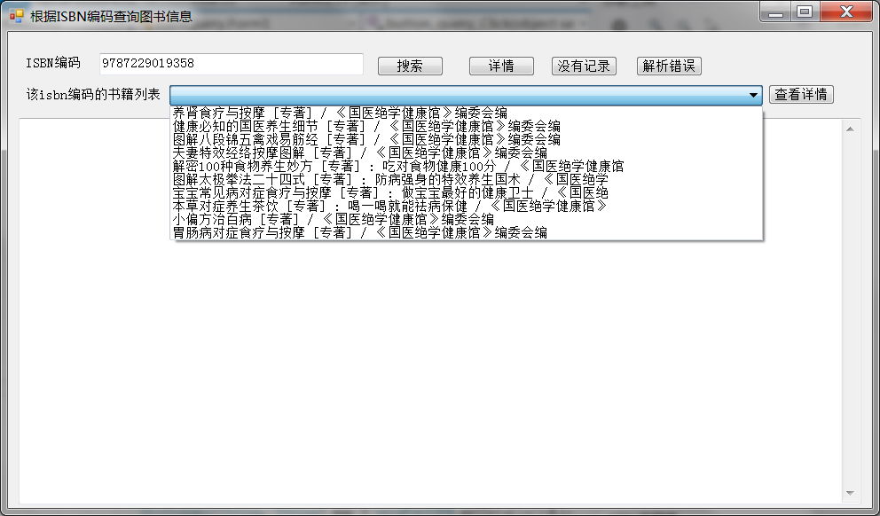

# 一个基于C#编写的通过ISBN编码查询图书信息的小爬虫
*** 
## 思路：
*通过分析国家图书馆联机公共目录查询系统的查询页面的结构及URL的参数,然后利用后C#代码发送http请求获取整个html页面，根据对应的页面规则解析得到想要提取的数据，最终使用map存储这些提取的数据:*  
1. **首先打开[国家图书馆查询页面](http://opac.nlc.cn/F)，通过form上的action里能拿到一个他自动生成的加密串（此加密串用于查询，每次要重新获取，如果一直用一个加密串查询的话，几分钟以后就不能再查了）**
2. **通过选择isbn,输入isbn编码点击查询，拿到URL上关键的固定不变的查询方式及查询参数的URL的部分**
3. **通过第一步获取的加密串拼接，就能拼接出一直都可以使用的新的加密串的查询URL，模拟它自己页面上的操作**
4. **首先使用代码模拟发送http请求获取整个html页面（可以自己随意找第三方框架，微软也提供了WebClient）**
5. **依赖HtmlAgilityPack框架，用于解析html的页面DOM，此框架使用XPath表达式，可以自行学习**
6. **最终解析table下的所有td，table只有两列，刚好符合map的key->value形式，所以最终使用map存储数据**
7. **最终还需要把td中的文本内包含的html的标记去除，一切OK**
8. **有的ISBN编码对应了多本书籍，所以查出来是一个书籍列表；解析列表，并利用它提供的超链接继续请求书籍的详情**

 
* author：loserStar
* email:362527240@qq.com
* email2:xinxin321198@gmail.com